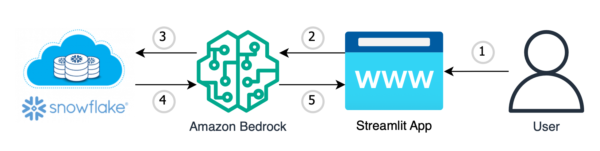

# Amazon-Bedrock-Snowflake-POC
This is sample code demonstrating the use of Amazon Bedrock and Generative AI to take natural language questions to query relational data stores, specifically Snowflake. This example leverages the MOMA Open Source Database: https://github.com/MuseumofModernArt/collection.


# **Goal of this Repo:**
The goal of this repo is to provide users the ability to use Amazon Bedrock and generative AI to take natural language questions, and transform them into relational database queries against Snowflake tables.
This repo comes with a basic frontend to help users stand up a proof of concept in just a few minutes.

The architecture and flow of the sample application will be:



When a user interacts with the GenAI app, the flow is as follows:

1. The user makes a request, asking a natural language question based on the data in Snowflake to the GenAI app (app.py).
2. This natural language question is passed into Amazon Bedrock, which takes the natural language question and creates a SQL query (snowflake_bedrock_query.py).
3. The created SQL query is then executed against your tables in Snowflake to begin retrieving the data (snowflake_bedrock_query.py).
4. The data is retrieved from Snowflake and passed back into Amazon Bedrock, to generate a natural language answer based on the retrieved data (snowflake_bedrock_query.py).
5. The LLM returns a natural language response to the user through the streamlit frontend based on the retrieved data. (app.py)

# How to use this Repo:

## Prerequisites:

1. Amazon Bedrock Access and CLI Credentials.
2. Snowflake Account and ability to create tables.
3. Ensure Python 3.9 installed on your machine, it is the most stable version of Python for the packages we will be using, it can be downloaded [here](https://www.python.org/downloads/release/python-3911/).

## Step 1:
The first step of utilizing this repo is performing a git clone of the repository.

```
git clone https://github.com/aws-rdoty/Amazon-Bedrock-Snowflake-POC.git
```

After cloning the repo onto your local machine, open it up in your favorite code editor.The file structure of this repo is broken into 4 key files,
the app.py file, the snowflake_bedrock_query.py file, the moma_examples.yaml file, and the requirements.txt. The app.py file houses the frontend application (streamlit app). 
The snowflake_bedrock_query.py file contains connectors into snowflake and the interaction with Amazon Bedrock through LangChains SQLDatabaseChain.
The moma_examples.yaml file contains several samples prompts that will be used to implement a few-shot prompting technique. Last, the requirements.txt
file has all the requirements needed to get the sample application up and running.

## Step 2:
Set up a python virtual environment in the root directory of the repository and ensure that you are using Python 3.9. This can be done by running the following commands:
```
pip install virtualenv
python3.9 -m venv venv
```
The virtual environment will be extremely useful when you begin installing the requirements. If you need more clarification on the creation of the virtual environment please refer to this [blog](https://www.freecodecamp.org/news/how-to-setup-virtual-environments-in-python/).
After the virtual environment is created, ensure that it is activated, following the activation steps of the virtual environment tool you are using. Likely:
```
cd venv
cd bin
source activate
cd ../../ 
```
After your virtual environment has been created and activated, you can install all the requirements found in the requirements.txt file by running this command in the root of this repos directory in your terminal:
```
pip install -r requirements.txt
```

## Step 3:
Now that all of the requirements have been successfully installed in your virtual environment we can begin configuring environment variables.
You will first need to create a .env file in the root of this repo. Within the .env file you just created you will need to configure the .env to contain:

```
snowflake_account=<snowflake account> example->"abc12345.us-east-1"
username=<username>
password=<password>
database=<database>
schema=<schema>
role=<role>
tables=["table_name_1", "table_name_2"]
aws_cli_profile=<aws_cli_profile_name>
```
Please ensure that your AWS CLI Profile has access to Amazon Bedrock!

Depending on the region and model that you are planning to use Amazon Bedrock in, you may need to reconfigure lines 19-25 in the snowflake_bedrock_query.py file:
```
llm = Bedrock(
        credentials_profile_name=os.getenv("aws_cli_profile"),
        model_id="anthropic.claude-v2",
        endpoint_url="https://bedrock-runtime.us-east-1.amazonaws.com",
        region_name="us-east-1",
        verbose=True
    )
```

# Step 4
If you would like to use this repo with the sample data, you will need to upload the two sample data files found in the sample data directory as two individual tables to Snowflake.

If you would prefer to use your own database/schema/tables in your Snowflake instance, I would highly reccomend reviewing the moma_examples.yaml file in the SampleData directory to see how prompts are constructed for this sample application and spend the time creating 5 - 10 prompts that resemble your dataset more closely.
# Step 5
At this point the application should be ready to go. To start up the application with its basic frontend you simply need to run the following command in your terminal while in the root of the repositories directory:

```
streamlit run app.py
```
As soon as the application is up and running in your browser of choice you can begin asking natural language questions against your SnowFlake tables.
